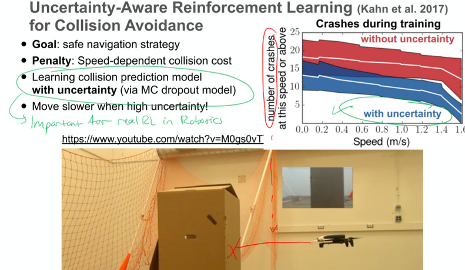

# Notes for 

## Code
* [Spinning Up in Deep RL!](https://spinningup.openai.com/en/latest/)
* [Stable Baselines3](https://stable-baselines3.readthedocs.io/en/master/) 

## Report 
- [ ]  Write citing it in the report basically at the end, With bibtex info …

## Midterm 15th December
- [ ]  Have a running model

## Endterm 
- [ ]  Presentation is a week before report
- [ ]  FINAL REPORT Mid February

## Exam date
- [X] Exam date?
  - [ ] Ask in Q&A 
  - Last semester the Endterm presentation was in 2 different days  
  - And the exam was a week after presenation (uncertain info)

## Future Work
- [ ]  Add to Future work in report:
      - 