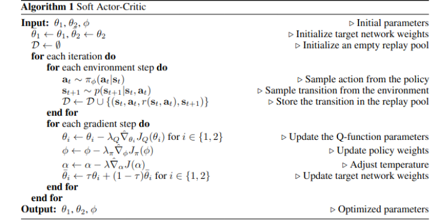
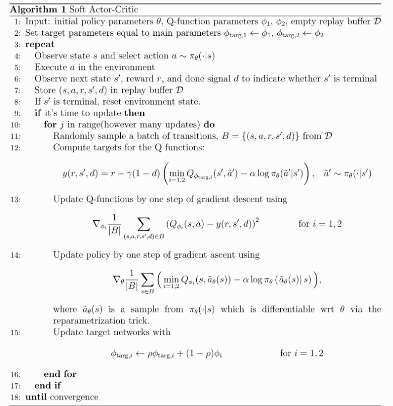
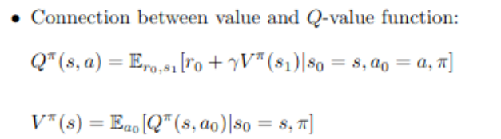
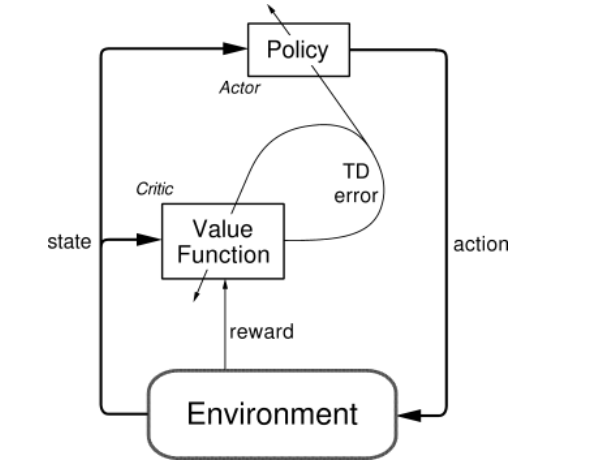

# 22-11-14 Weekly Meeting Questions (See TODO above for structured version)

- [X] Continuous action space?? OR Bigger Grid
    - 2 values basically for direction and velocity
    - [X] We can try to let NN predict the right amount of speed
    - [X] Maybe use normalized so that the NN learns the scaling anyway
    - [X] We may have to filter the outputs, as the smoothed result from policy might be in the wrong direction with wrong direction in exploration
    - moving avg filter on the network output for smoothness, velocity and direction
- [X] Continious collison detection func?
  - with the trajectory prediction one step ahead
  - if says might collide (e.g. following a car)
    - we can say we play safe and think all these situations as collision
    - if the obstacle moves away, then collision chance drops
    - if the obstacle perpendicular, then collision chance drops
    - control the velocity of the agent to avoid collision
    - more detailed version would include physic simulators with solver, there are papers for this
  - make the velocity range small (e.g. 20km/h)
  - have a delta time scaling to real velocity 

- Pytorch for parallel simulation(might not be needed), but keep an eye on performance

- [ ]  Our example algo.
    - [ ]  Reparam noise?
    - [ ]  Value loss 0.5?
        - might be a trick
        - check stable baselines or the original SAC paper

   
- [X]  Desining the reward function
  - [X]  Value comparison of goal and collision
    - [X]  10/-1 is this normal behavior for RL 
  - Current model: Potential Field MP
  - potential field is a dense reward, as we get a reward for every step
    - agent gets greedy and tries to get the reward as fast as possible
  - sparse rewards only when there is a collision, or reach the goal
    - 1 for goal, -1 for collision (from extensive testing in a project last semester) nothing more
      - sub-sparse rewards: rewards like radius checkpoints when moving towards the goal is also possible
        - will make waiting behavior more likely, which wouldn't happen in dense rewards
        - but also don't reward it again for stepping over it again
        - can be a nice sub study
      - sub sparse rewards: punish it every e.g. 100 time step to make it go towards to goal at one point
        - or terminate the episode after 100 time steps and give a reward of -1 
      - Examples of sub-sparse rewards: (added to the global reward) 
        - waiting behavior: reward for waiting for 10 time steps
        - moving at least 10 m in 1 direction 
    - then we can define sub-sparse rewards from  MetaRL/SAC-X
      - e.g. to solve the recursive same movement problems we face at static environments
      - as the mixed environment is very crucial

- For the midterm presentation a possible milestones
- E.g. Comparing 500.000 env steps with our env, how well the dense/sparse rewards performed
    - 1st in static env
    - then in dynamic envs with random init for movements 
      - make sure to have a random seed to reproduce the results)

- [X] input-outputs of networks
  - actor network
    - in: position of the agent, position of the goal, position of the obstacles
    - out: mean and std of the velocity in 2 directions
  - critic network 1
  - in: action of agent and position of the agent, position of the goal, position of the obstacles
  - out: q value
  - critic network 2
  - value network
  - in: position of the agent, position of the goal, position of the obstacles
  - out: v value
  - sort the input depending on the distance to the robot 
    so that the network has a structured input (like attention with transformers)

- [ ] SAC-X/Meta-RL Paper Qs 
  - wait until we have a working model
  - and then depending on where it goes choose one to implement
  - as the papers

- [ ] SAC QS
  - [X] why 2 critic networks
    - Double Q-Learning also in the lectures 
    - see answer in piazza
    - if not it doesn't converge well 
  - The other trick in SAC
    - in sac we take the entropy we depends on random variables
    - we need the gradient of the entropy but we cant 
    - the noise is additive so say its constant and just add it to the gradient
  - [X] with sparse rewards SAC-X doesnt work well and seems like it moves randomly
    - but that is exactly we need in a dynamic environment
  
- [ ] Ideas
    - [ ] pretraining the actor network with a search algo like A*(in discrete grdi) or RRT(in continous space)
      - for the static scene there is a potential
        - SAC is a middle ground offline RL / on-policy RL depending the amount of action in the replay buffer 
        - fill the replay buffer with the pretraining on static env 
        - so that we already know 1 good policy that reaches the goal (but then we dont have a model free approach)
          - but we can also erase the replay buffer with these A* results after some episodes
      - for dynamic scene it wouldnt work
      - we can just assume that the agent found the perfect trajectory in history and add that to the replay buffer
        - this would still be a model free approach
        - the critic would learn the value of the trajectory in time 
        - BUT make it noisy 
        - but in real life we dont have this perfect trajectory for RL tasks
          - trade off between model free and model based
          - but this supervised approach might collapse for complex dynamic envs.
          - e.g. in a dynamic env with a lot of obstacles and a lot of possible trajectories, 
            we can't know the solution
          
- [ ] Exam date?
  - Ask in Q&A 
  - Last semester the Endterm presentation was in 2 different days  
  - And the exam was a week after presenation (uncertain info)

- [ ] Google Coupon Activation Code from Felix
  - next week a short introduction on usage of google cloud
  - use cpu and the cheaper machines (that google can shutdown)
  - we can use different machines for different configurations 
  - (e.g. 1 machine for each test from dense to sparse to find a sweet spot)
  - use tensorboard or w&b for logging

- do the sparse dense interpolation experiment 
- do the jump start experiment -> see line 4 in [Spinning Up SAC Pseudo Code](#22-11-09-team-9)

# 22 11 09 Team 9

## TO DO
- [X] Make the grid bigger
    - [X] No discretized action space just values v_x, v_y later
- [X] V: Add notes to Git-hub as issues?
- [X] Change DQN of the examlpe code with an easy SAC (find an easier example and adapt to grid_planning)
    - From [SAC paper](https://arxiv.org/pdf/1812.05905.pdf) 
    - 
    - From [Spinning Up](https://spinningup.openai.com/en/latest/algorithms/sac.html#pseudocode) 
    - 
    - From ADLR Lecture: Value - Q Func. Connection
    - 
    - [Actor critic architecture]((http://incompleteideas.net/book/first/ebook/node66.html))
    - 

# 22-11-07 Weekly Meeting Questions

## Questions
- [X]  Cite the uploaded code on github! And change our curent one, HOW?
    - [X]  Write citing it in the report basically at the end 
    - [X] With bibtex info …
- [X] Questions to understand the papers
    - [X] Next week again
- [X]  Is the presentation on 15th online?
    - [X] Yes it is online!
    - [X] Have stable internet
- [X] Presentation is a week before report
- [X] FINAL REPORT Mid February
- [X] Continious action space??
    - [X] 4 values basically for direction and velocity
    - [X] We can try to let NN predict the right amount of speed
    - [X] Maybe use normalized so that the NN learns the scaling anyway
    - [X] We may have to filter the outputs, as the smoothed result from policy might be in the wrong direction with wrong direction in exploration
- [X] Use GYM Box Car Racing as a use case for the generally trained RL we have at the end, start with your own 2D box with Maybe for navigation in autonomous driving do it a the end

## TO DO
- [X] Start with Gym Custom Env / Car Racing + stable baselines SAC
- [X] Implement SAC on your own, as sometimes with this stable baseline/spinning up its already the comes with the fixed API
    - [X] Think of the already implemented version as plan B
- [X] Use GYM Box Car Racing as a use case for the generally trained RL we have at the end, start with your own 2D box with Maybe for navigation in autonomous driving do it a the end
- [X] Google Coupon Activation in Mail

# 22-11-05 Team 9

## TODO
- [X] Read Learning by Play
- [X] This is already a lot of work. Check out the open ai
[https://spinningup.openai.com/en/latest/](https://spinningup.openai.com/en/latest/)
- [X] as well as[ https://stable-baselines3.readthedocs.io/en/master/](https://stable-baselines3.readthedocs.io/en/master/). 
Here you will find some implementations of SAC which you can use as your starting point for implementing the Meta-RL and/or SAC-X algorithm. In case you use open-source code, please make sure that you cite it properly and mark your own contribution in your implementation visible
